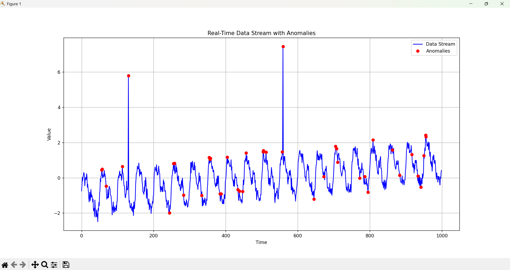
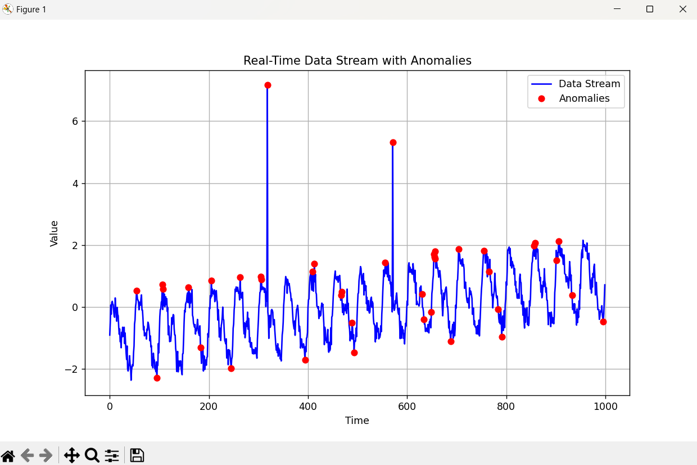

# Efficient Data Stream Anomaly Detection

## Working Demo



## Project Overview
The Efficient Data Stream Anomaly Detection project is designed to detect anomalies in a continuous data stream using Python. The project simulates real-time data sequences and applies a K-Nearest Neighbors (KNN) algorithm to identify unusual patterns, such as spikes or deviations from the norm. The project provides real-time visualization of both the data stream and detected anomalies.

## Table of Contents
- [Project Overview](#project-overview)
- [Project Structure](#project-structure)
- [Features](#features)
- [Installation](#installation)
- [Usage](#usage)
- [Modules Description](#modules-description)
- [Algorithm Explanation](#algorithm-explanation)
- [working demo](#demo)
 

## Project Structure
efficient-data-stream-anomaly-detection 
├── src # Directory containing the main modules 
    │ ├── data_stream.py # Data stream generation module
     │ ├── knn_anomaly_detector.py # KNN-based anomaly detection module 
     │ ├── visualize.py # Visualization module for the data stream 
     │ └── main.py # Main script to run the project
  ├── requirements.txt # Python dependencies 
  └── README.md # Project documentation

## Features
- Real-time anomaly detection using the K-Nearest Neighbors (KNN) algorithm.
- Dynamic visualization of data stream with highlighted anomalies.
- Customizable data generation with seasonal patterns, noise, and trends.
- Robust error handling and validation for reliable execution.


## Installation and Setup

1. **Clone the repository**:
   ```bash
   git clone https://github.com/Bhaskar-786/Real-Time-Anomaly-Detector
   cd Data-Anomaly-Detector

2. **Set up the environment**:
    Install the required dependencies using pip
    ```bash
    pip install -r requirements.txt

3. **Run the project**
    Navigate to the src folder and run the main.py script
    ```bash
    python src/main.py


## Modules Description

### 1. data_stream.py
**Purpose**: This module is responsible for generating the data stream used for anomaly detection. The generated data stream includes seasonal variations, random noise, and gradual trends to simulate real-world data patterns.

 
  
  **Returns**: A numpy array containing the generated data stream.

### 2. knn_anomaly_detector.py
**Purpose**: This module implements the K-Nearest Neighbors (KNN) algorithm for detecting anomalies within the data stream. It uses a sliding window approach to detect deviations in the data points.

**Class**: `KNNAnomalyDetector`
- **Initialization Parameters**:
  - `window_size` (int): The size of the sliding window for the KNN model.
  - `n_neighbors` (int): The number of neighbors to consider for distance calculations.
  - `threshold_percentile` (int): The percentile value used to determine the anomaly detection threshold.

**Key Methods**:
- `fit_knn()`: Trains the KNN model using the data points in the current sliding window.
 - `detect_anomaly(new_point)`: returns A tuple `(is_anomaly, max_distance)`, where `is_anomaly` is a boolean indicating if the point is an anomaly and `max_distance` is the calculated distance
  

### 3. visualize.py
This module provides functionality to visualize the data stream along with detected anomalies using Matplotlib.

### 4. main.py
**Purpose**: The main script that orchestrates the anomaly detection process. It integrates all the other modules to generate the data stream, detect anomalies using the KNN algorithm, and visualize the results.

**Main Workflow**:
1. Generates a data stream using `generate_data_stream()` from `data_stream.py`.
2. Initializes the `KNNAnomalyDetector` from `knn_anomaly_detector.py` and detects anomalies in the data stream.
3. Visualizes the data and detected anomalies using `visualize_stream()` from `visualize.py`. 

# Algorithm Explanation

## Overview
The Efficient Data Stream Anomaly Detection project employs the K-Nearest Neighbors (KNN) algorithm for anomaly detection in a continuous data stream. KNN operates as an unsupervised learning algorithm, identifying data points that significantly deviate from their neighbors based on distance calculations.

## KNN Algorithm Details

### 1. Distance Calculation
- The algorithm calculates the distance between each data point and all other data points within a sliding window.
- Typically, the Euclidean distance is used as the primary metric, although other distance measures can be applied as well.

### 2. Neighbor Selection
- For each data point, the `k` nearest neighbors are identified. These neighbors are the data points with the smallest distances to the point in question.
- The choice of `k` plays a crucial role in the algorithm’s sensitivity to anomalies. A smaller `k` makes the algorithm more sensitive to outliers, while a larger `k` results in more conservative anomaly detection.

### 3. Anomaly Score Calculation
- Each data point's anomaly score is determined based on the distances to its `k` nearest neighbors.
- A dynamic threshold, typically calculated as a specified percentile (e.g., 95th percentile) of all neighbor distances, is used to identify anomalies.
- Points with distances exceeding this threshold are considered anomalies.


 
